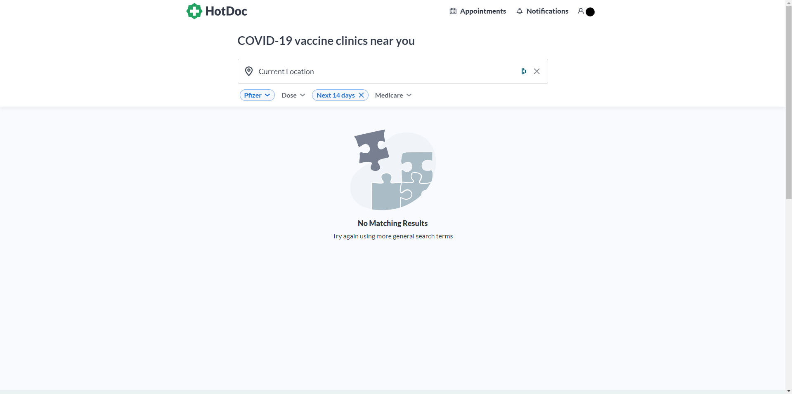

# Vaccine Finder Extension
This is a super simple extension that I cooked up to help myself find a Pfizer booking with the HotDoc website.
It just refreshes the page once activated until a search result is returned, in which case it stops and notifies the user.

To use, install the extension in developer mode and open up a hotdoc search that won't return any results you don't want, it'll keep refreshing once you click on it in the extensions button (in the toolbar) until there's a search result.

